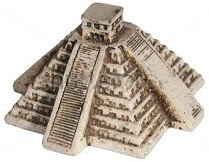

The Aztec JavaScript Framework
==============================

Requirements: 
  - ruby gems: erubis, nokogiri, watchr (auto build)
  - node package: docker (generate docs)

Link Package:
  Go to ./release/scripts run `npm link`

Test:
  After link package with npm, run `mocha` in project folder
